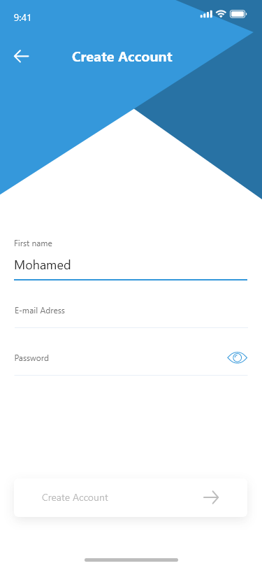
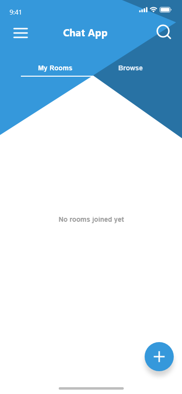
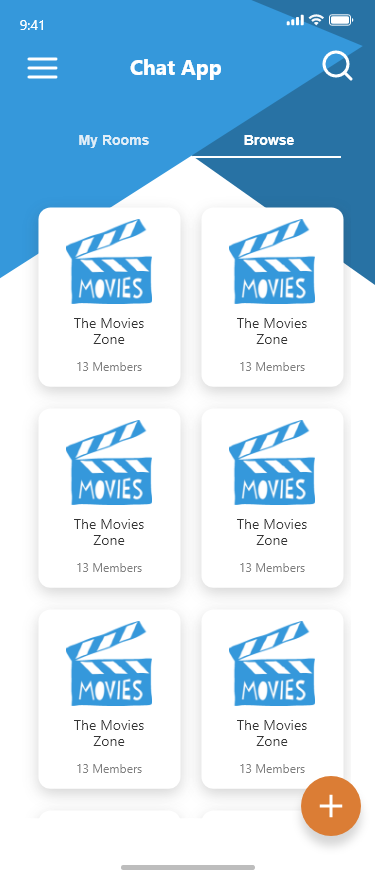
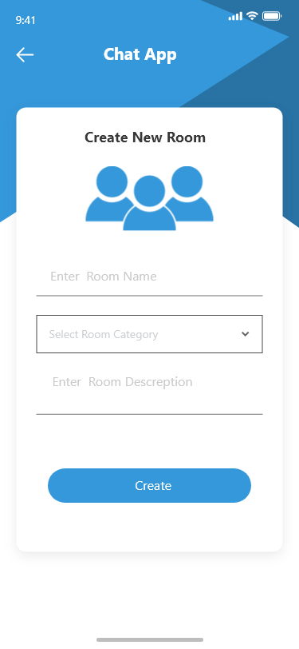
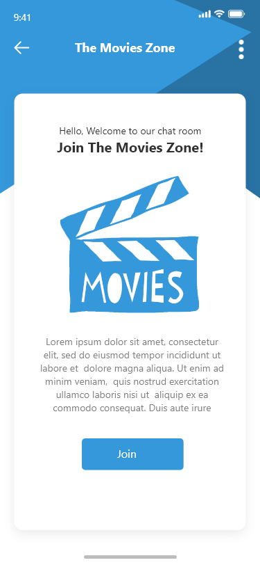
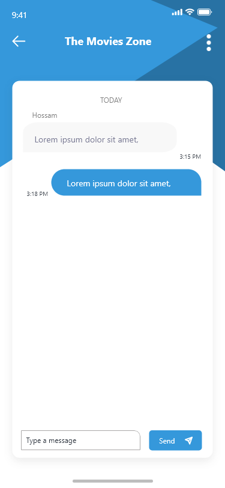

# Chat App

## 📑 Table of Contents
1. [🚀 Introduction](#-introduction)
2. [🛠 Installation & Setup](#-installation--setup)
3. [🤝 Contribution Guide](#-contribution-guide)
4. [🖥️ Technical Stack](#️-technical-stack)
5. [🎥 Demo Video](#-demo-video)
6. [🛠 Features](#-features)
7. [📷 Screenshots](#-screenshots)
8. [👥 Contributors](#-contributors)

## 🚀 Introduction
Chat App is a modern, real-time messaging platform built with Flutter and Firebase. It offers users the ability to create and join chat rooms, participate in group discussions, and enjoy a seamless communication experience with a clean, intuitive interface.

## 🛠 Installation & Setup
To run this project locally, follow these steps:

### Prerequisites
- **Flutter SDK**: Ensure you have Flutter SDK installed. [Download Flutter](https://flutter.dev/docs/get-started/install)
- **Firebase Account**: Set up a Firebase project and download the configuration files
- **IDE**: Use Android Studio, VS Code, or IntelliJ IDEA with Flutter plugins installed
- **Device/Emulator**: Physical device or emulator for testing

### Steps
1. Clone the repository:
   ```bash
   git clone https://github.com/Mohammedhussein12/chatty_app.git
   cd chat-app
   ```

2. Install dependencies:
   ```bash
   flutter pub get
   ```

3. Add Firebase configuration files:
    - Add `google-services.json` to `android/app`
    - Add `GoogleService-Info.plist` to `ios/Runner`

4. Run the app:
   ```bash
   flutter run
   ```

## 🤝 Contribution Guide
We welcome contributions! Here's how to contribute:

1. Fork the repository
2. Create your feature branch: `git checkout -b feature/AmazingFeature`
3. Commit your changes: `git commit -m 'Add some AmazingFeature'`
4. Push to the branch: `git push origin feature/AmazingFeature`
5. Open a Pull Request

## 🖥️ Technical Stack

### Core Technologies
- **Flutter**: Primary framework for cross-platform development
- **Dart**: Programming language
- **Firebase**: Backend and real-time database

### Dependencies
- **firebase_core (^2.25.0)**: Firebase core functionality
- **cloud_firestore (^4.15.0)**: Cloud Firestore for real-time data storage
- **firebase_auth (^4.17.0)**: Authentication services
- **flutter_bloc (^8.1.6)**: State management
- **flutter_screenutil (^5.9.3)**: Responsive UI design
- **google_fonts (^6.2.1)**: Custom font styling
- **fluttertoast (^8.2.8)**: Toast notifications
- **intl (^0.20.0)**: Internationalization and formatting
- **cupertino_icons (^1.0.8)**: iOS-style icons

## 🎥 Demo Video
Watch the demo video to see the application in action:
**[Demo Video Link](https://drive.google.com/file/d/1uZxQGUbnmtNlZgKy1H-oVOukys_Xokqd/view?usp=drive_link)**

## 📷 Screenshots

| Splash                                        | Register                                        | Login                                         |
|-----------------------------------------------|-------------------------------------------------|-----------------------------------------------|
|  |  |  |

| Home1                                         | Home2                                  | Create Room                                        |
|-----------------------------------------------|----------------------------------------|----------------------------------------------------|
|  |  |  |

| Room Details | Chat Interface |
|--------------|----------------|
|  |  |

## 🛠 Features

### 💬 Chat Functionality
- Real-time messaging
- Group chat rooms
- Message timestamps

### 🏠 Room Management
- Create new chat rooms
- Browse available rooms
- Room categories

### 👤 User Features
- User authentication
- Profile customization
- Account creation
- Remember me functionality

### 🎨 UI/UX Features
- Clean, modern interface
- Responsive design
- Toast notifications
- Loading indicators
- Error handling

### 🔍 Search & Navigation
- Search rooms
- Room categorization
- Easy navigation
- Recent chats
- Quick actions


## 👥 Contributors
- **Mohammed Hussein** ([Mohammedhussein12](https://github.com/Mohammedhussein12))